# Overview
Leave Register is application here I have done as a single page application. This application is done for just to get confident on C#, Web Services, ADO.NET,  SQL, jQuery, HTML5, Bootstrap CSS and JQuery data table.

Here I have taken care coding standard and comments. Identifier is understandable by reading itself.

As in this document I am giving brief introduction of application along with how to use first time and what are all the things require to use in the respect of hardware & software. 

# Funntionality
- ## Admin Employee
  1.	Add/Edit  Employee information’s
  2.	Add/Edit/Remove company leave
  3.	Add/Edit/Remove company news
  4.	Edit Employee’s attendance by admin at any time
  5.	Check/Validate employee attendance
  6.	Get worked time of each employee in a day
  7.	Approve/Reject applied leave by employee
  8.	Set/Edit  working hours
  9.	Set/Edit total leaves
- ## Employee
  1.	Fill their daily attendance
  2.	Employee will get prompt if employee hasn’t filled their attendance.
  3.	Employee cal apply any type of leave
  4.	Employee can see their leave status
  5.	Employee can see how many leave is left with corresponding leave
  6.	Employee can see all company leave which is added by admin. So accordingly employee can apply leave
  7.	Employee can change their password at any time
  8.	Employee can edit their personal information like date of birth
  9.	Employee can check their previous date attendance by selecting of date
  10.	In application itself has been described how employee can use this application easily
  11.	All controls are having tooltip, so by hover the mouse it tells what and why?

# How TO Run
You must be have 
1.	SQL 2008
2.	Visual studio
3.	IIS
	
# How to use
Please follow the below steps to use Leave Register application
1.	Visit my git hub site  https://github.com/njay26/ 
2.	Download Leave Register solution
3.	Open with Visual studio
4.	First time open LeaveRegisterSetup page 

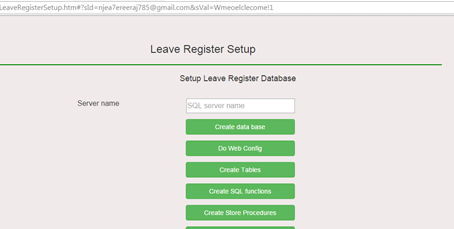

5.	Give your SQL object name in the SQL server name text box
6.	Then click on Create Data Base button
7.	After that click on Do We Config button
8.	Click on Create Tables button
9.	Click on Create SQL Function button
10.	Click on Create store Procedure button
11.	After that click on Do Leave Register Setting bbutton
12.	Add admin employee with entering the all information’s 

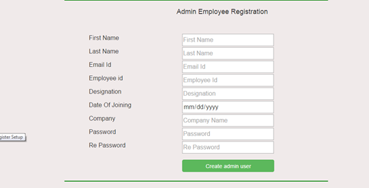

## Login Page
Once you got success message. Then open main page LeaveRegister.HTML 
There Admin employee can login with their credentials

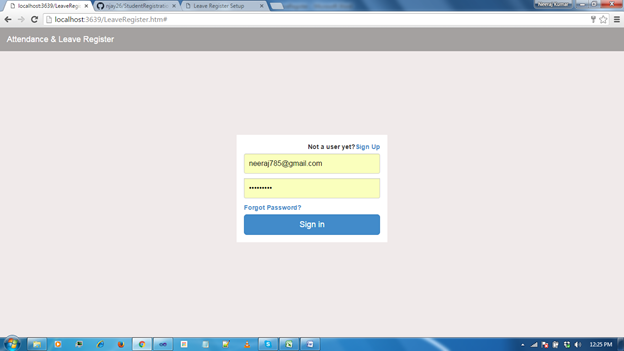

## Home 
After login he will land in the home page (Updates, Attendance and News).

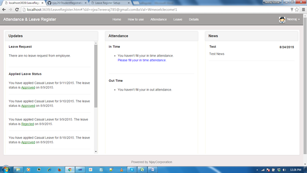

## In Update section 
- If admin employee has logged in then he can see requested leave by employee. From there he can approve/Reject same leave
- Also admin employee can see their applied leave status
- If normal employee has logged in then he can see only their applied leave status
## In attendance Modal
- It just shows have submitted your attendance or not?
## In News Modal
- Here all employees can see news which is being loaded by admin.
## Attendance Tab
To fill the attendance you need to click on attendance tab from there you can fill your in and out time attendance.

 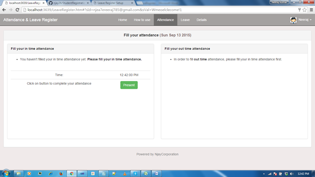
 
## Leave Tab
To apply the leave you need to click on Leave tab. Here you can see loaded company leave.

  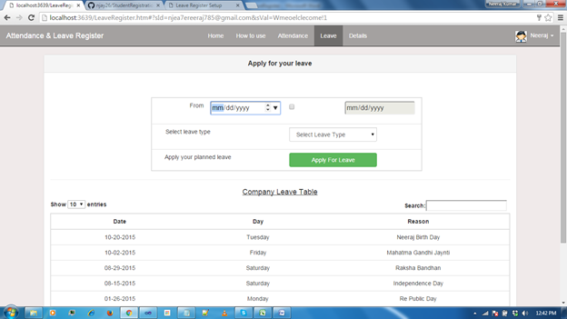

## Details Tab
Here employee can see their details in respect to attendance and leave even he can download their monthly attendance sheet.

  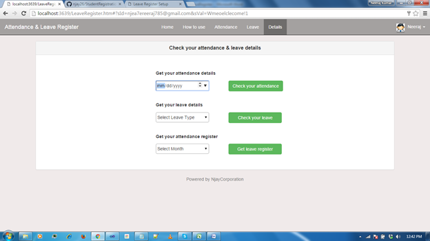

## Admin Employee

Click on Carat then you will be able to see Admin link (only if you are admin employee)

 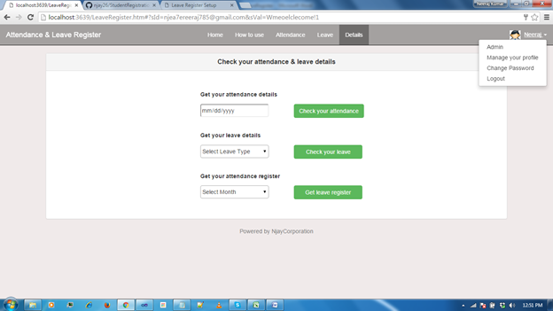
 
If you are admin employee you can perform action 

 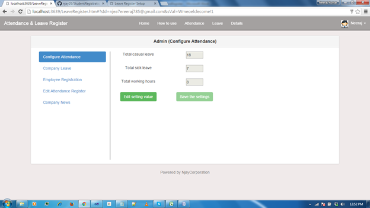
 
 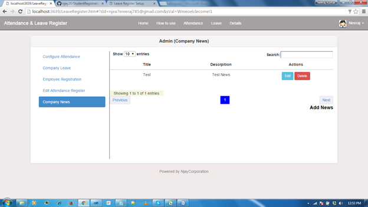
 
 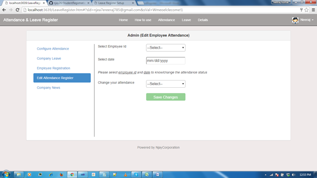
 
 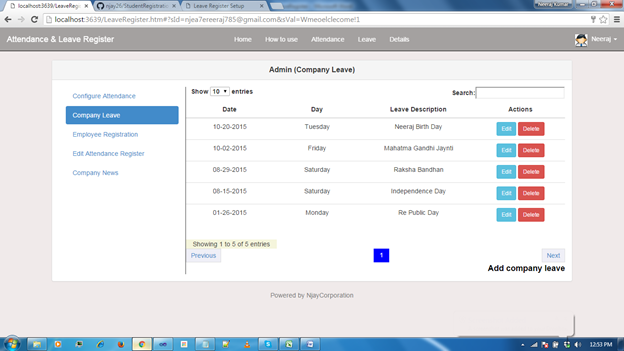
 
 
 

## Note: 
Suppose admin has added new employee. Please follow the below steps to access the leave register by normal employee.
1.	Click on Sign Up button

 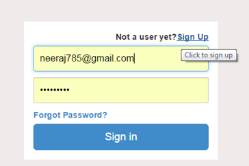
 
2.	Enter your company email id and employee id
3.	Then you need enter password and re password
4.	Click on Sign UP button.

  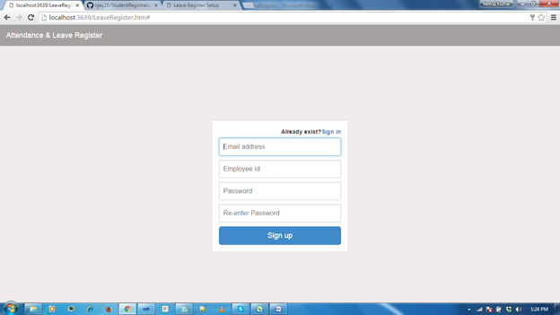
  
5.	After that you can sign in from sign in farm.

# Thank You!

